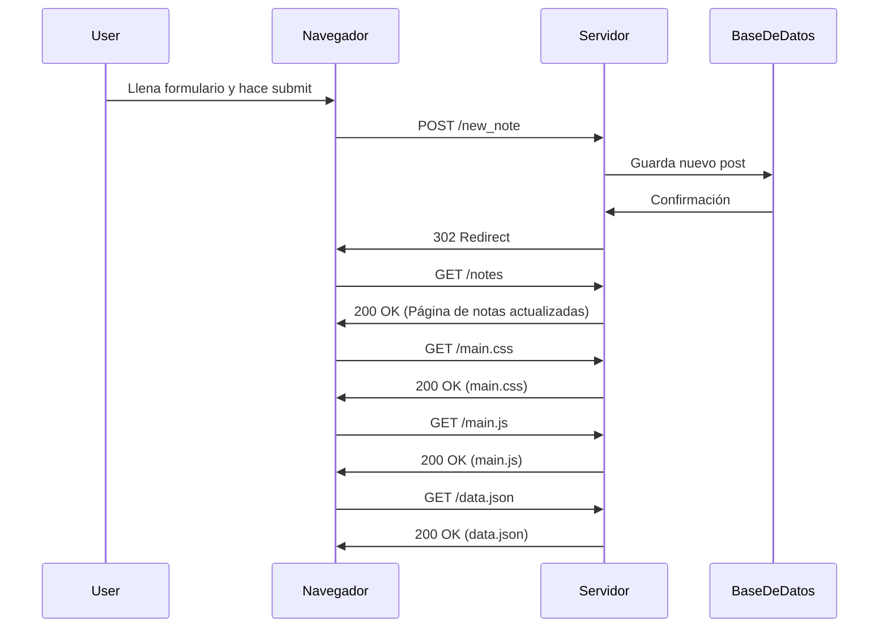

```mermaid
sequenceDiagram
    participant User
    participant Navegador
    participant Servidor
    participant BaseDeDatos

    User ->> Navegador: Llena formulario y hace submit
    Navegador ->> Servidor: POST /new_note
    Servidor ->> BaseDeDatos: Guarda nuevo post
    BaseDeDatos ->> Servidor: Confirmación
    Servidor ->> Navegador: 302 Redirect
    Navegador ->> Servidor: GET /notes
    Servidor ->> Navegador: 200 OK (Página de notas actualizadas)
    Navegador ->> Servidor: GET /main.css
    Servidor ->> Navegador: 200 OK (main.css)
    Navegador ->> Servidor: GET /main.js
    Servidor ->> Navegador: 200 OK (main.js)
    Navegador ->> Servidor: GET /data.json
    Servidor ->> Navegador: 200 OK (data.json)
```