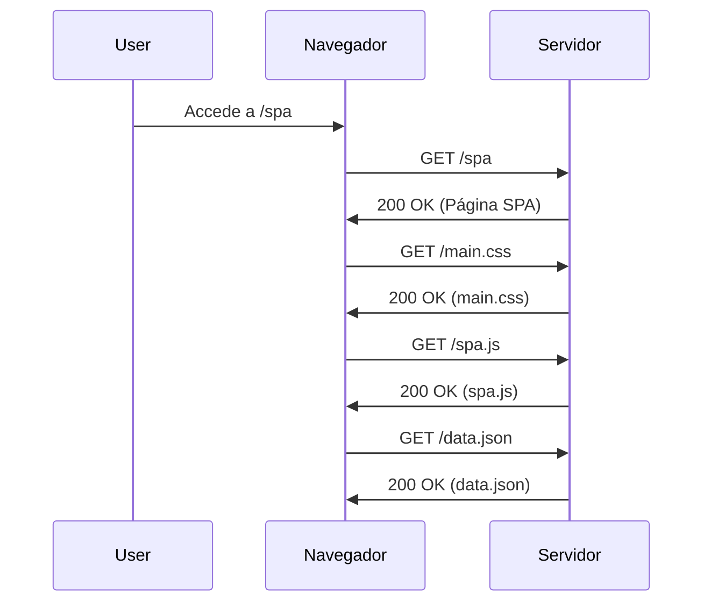

```mermaid
sequenceDiagram
    participant User
    participant Navegador
    participant Servidor

    User ->> Navegador: Accede a /spa
    Navegador ->> Servidor: GET /spa
    Servidor ->> Navegador: 200 OK (Página SPA)
    Navegador ->> Servidor: GET /main.css
    Servidor ->> Navegador: 200 OK (main.css)
    Navegador ->> Servidor: GET /spa.js
    Servidor ->> Navegador: 200 OK (spa.js)
    Navegador ->> Servidor: GET /data.json
    Servidor ->> Navegador: 200 OK (data.json)
```